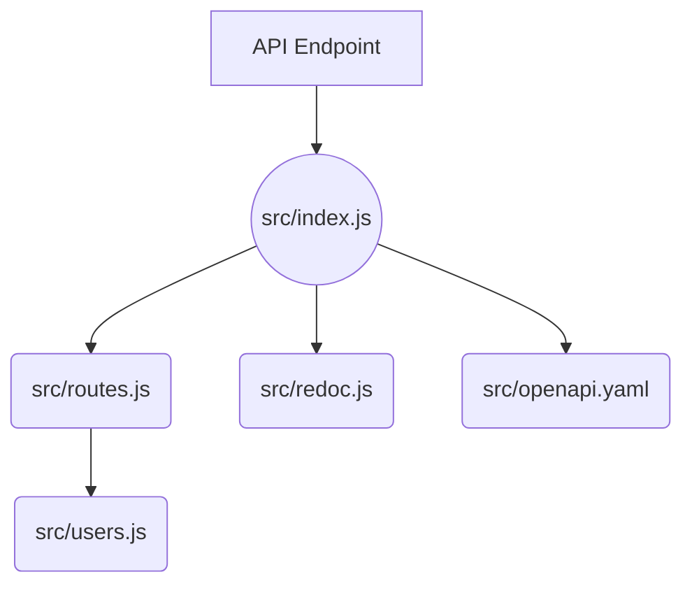

# GitHub DX Demo

Demo repository to show an integrated developer experience flow working with GitHub ecosystem components.

## TODO

This repository is a work in progress, the following items still need attention

- [ ] Update the README story path to fill out with descriptive instructions for each step
- [ ] Incorporate Actions development into the story path
- [ ] Incorporate CodeQL development into the story path
- [ ] Incorporate Secrets Scanning development into the story path
- [ ] Create an Actions workflow to interact with submitted Issues and PRs
- [ ] Update devcontainer configuration for a streamlined configuration to use with this repository
- [ ] Populate with issue and PR template(s)
- [ ] Create Actions workflows so that this can be a template repository and easily re-used

## Using this Repository

This repository is meant to use for demo purposes.

Story path for this repo (roughly):

- Navigate to the repo and talk about the functionality of it and purpose.  Near the start highlight the devcontainer.json and how it is used to create a codespace.  Launch the codespace and while it is spinning up navigate around the code to show the structure of the repo.
- Open the repo in a codespace and launch the app, show the app running to describe the current data which is present and the associated API docs.
- Create a new issue in the repo to capture an enhancement of adding password and location to the user model
  - **OPTIONAL1** - Create a new issue to dynamically generate the user data
  - **OPTIONAL2** - Create a new issue to add a query parameter to the API to specify the number of users to return
- Show the issue in the project board and move it to the "In Progress" column, take ownership of the issue
- create a branch for the created issue within the open codespace
- Update the openapi.yaml file to add the new fields to the user model
- Update the users.js file to add the new fields to the user data.  While here, add a few more users in the data, using comment prompt for Copilot to help with generating the data.
  - **OPTIONAL1** - Update the users.js file to dynamically generate the data using @faker-js/faker.  This will require adding the faker package to the package.json file and then updating the users.js file to use the faker package to generate the data.
  - **OPTIONAL2** - Update the app to specify the number of users to return in the response.  This will require adding a query parameter to the route and then updating the users.js file to use the query parameter to determine how many users to return.
- commit the changes to the branch and push the branch to the repo, create a PR for the changes.
- Show the Actions which are running as part of the PR and note that the CI check fails due to dist not being up to date.
- Run `npm run build` to update the dist folder and then push the changes to the branch.
- **OPTIONAL-ACTIONS** - Create a new PR action to call testing and build actions in a desired order, rather than running them in parallel.
- Navigate to Repository rules to setup protection rules for the default branch
- Merge the PR, show the actions running and container publishing to GHCR
- Close the issue as completed, destroy codespace

## Content Modules

### Codespaces

### Issues, Projects & Pull Requests

### Actions

### Copilot

### CodeQL

### Dependabot

### Secrets Scanning

### Packages

---

## Users API

This is an Express API application that provides sample users with data via an API endpoint that can be used by other applications to populate test data.

## Application Layout

Here's a mermaid diagram of the application layout:



## App Content

The [./src](./src/) directory contains the following files:

- [index.js](./src/app.js): This file sets up the Express app and defines the routes for the API.
- [routes.js](./src/routes.js): This file defines the routes for the API. It uses the users.js file to handle requests to the /users endpoint.
- [users.js](./src/users.js): This file contains the controller functions for the /users endpoint. It reads the sample user data from the users.json file and returns it in response to requests.
- [openapi.yaml](./src/openapi.yaml): This file contains the OpenAPI specification for the UsersAPI. It is used to generate the API documentation.
- [redoc.js](./src/redoc.js): This file contains the configuration for the ReDoc API documentation.  Relies on the openapi.yaml file.

## Docker Packaging

This project is packaged using a Docker container for runtime distribution. :ship:

To build the Docker container locally, follow these steps:

- Build the Docker image using the following command:

  ```bash
  docker build -t <image-name> .
  ```

- Replace <image-name> with a name for your Docker image.
- Run the Docker container using the following command:

  ```bash
  docker run -p 3000:3000 <image-name>
  ```

  This will start the Docker container and make it available at [http://localhost:3000](http://localhost:3000).
