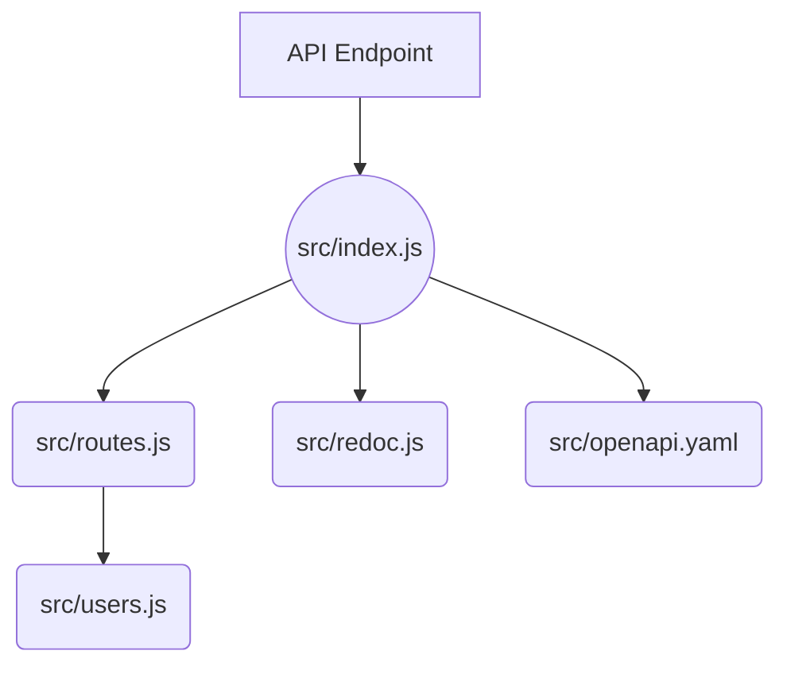

# GitHub DX Demo

Demo repository to show an integrated developer experience flow working with GitHub ecosystem components.

Expand `details` to see workshop contents

<details>
<summary>Click to Expand Workshop Contents</summary>

## TODO

This repository is a work in progress, the following items still need attention

- [ ] Update the README story path to fill out with descriptive instructions for each step
- [ ] Incorporate Actions development into the story path
- [ ] Incorporate CodeQL development into the story path
- [ ] Incorporate Secrets Scanning development into the story path
- [ ] Create an Actions workflow to interact with submitted Issues and PRs
- [ ] Update devcontainer configuration for a streamlined configuration to use with this repository
- [ ] Populate with issue and PR template(s)
- [ ] Create Actions workflows so that this can be a template repository and easily re-used

## Using this Repository

This repository is meant to use for demo purposes.

<details>
<summary>Story Path Overview</summary>
Story path for this repo (roughly):

- Navigate to the repo and talk about the functionality of it and purpose.  Near the start highlight the devcontainer.json and how it is used to create a codespace.  Launch the codespace and while it is spinning up navigate around the code to show the structure of the repo.
- Open the repo in a codespace and launch the app, show the app running to describe the current data which is present and the associated API docs.
- Create a new issue in the repo to capture an enhancement of adding password and location to the user model
  - **OPTIONAL1** - Create a new issue to dynamically generate the user data
  - **OPTIONAL2** - Create a new issue to add a query parameter to the API to specify the number of users to return
- Show the issue in the project board and move it to the "In Progress" column, take ownership of the issue
- create a branch for the created issue within the open codespace
- Update the openapi.yaml file to add the new fields to the user model
- Update the users.js file to add the new fields to the user data.  While here, add a few more users in the data, using comment prompt for Copilot to help with generating the data.
  - **OPTIONAL1** - Update the users.js file to dynamically generate the data using @faker-js/faker.  This will require adding the faker package to the package.json file and then updating the users.js file to use the faker package to generate the data.
  - **OPTIONAL2** - Update the app to specify the number of users to return in the response.  This will require adding a query parameter to the route and then updating the users.js file to use the query parameter to determine how many users to return.
- commit the changes to the branch and push the branch to the repo, create a PR for the changes.
- Show the Actions which are running as part of the PR and note that the CI check fails due to dist not being up to date.
- Run `npm run build` to update the dist folder and then push the changes to the branch.
- **OPTIONAL-ACTIONS** - Create a new PR action to call testing and build actions in a desired order, rather than running them in parallel.
- Navigate to Repository rules to setup protection rules for the default branch
- Merge the PR, show the actions running and container publishing to GHCR
- Close the issue as completed, destroy codespace

</details>

## Demo Story

### Familiarize with the Repository

The repository is a simple Express API application that provides sample users with data via an API endpoint that can be used by other applications to populate test data.  Review the [Application Layout](#application-layout) section for details on the application layout.  The current user model provides
very basic information about the user, including name and an emoji.  The API endpoint is documented using OpenAPI and the documentation is available via ReDoc.

### Create a New Issue

Enhancements and bug fix work against the application are tracked using GitHub Issues.  Creating issues for work provides visibility and historic context for the work being done.  In some cases, an issue would be filed against a repository for the maintainer(s) to pick up and work on.  In other cases, an issue would be filed against a repository for the community to pick up and work on.  In this case, we will be filing an issue against the repository for the maintainer(s) to pick up and work on (us).

Create an issue of type `enhancement request`, with the title `Add password and location to user model`.

Add the following description to the issue:

```plain
The current user model provides very basic information about the user, including name and an emoji.
Add password and location to the user model to provide more information about the user.
```

### Launch a Codespace

GitHub Codespaces is a cloud-based development environment that allows developers to write, run, and debug their code directly from their web browser. It provides a fully configured and customizable development environment that can be accessed from anywhere, without the need for local setup or installation.

Some benefits of using GitHub Codespaces include:

- **Flexibility**: Developers can work from anywhere, on any device, without the need for local setup or installation.
- **Consistency**: All developers have access to the same development environment, ensuring consistency across the team.
- **Collaboration**: Multiple developers can work on the same project simultaneously, without the need for complex setup or configuration.
- **Scalability**: Codespaces can be easily scaled up or down to meet the needs of the project.

To launch a Codespace from the repository, follow these steps:

- Click on the "Code" button in the repository.
- Under the "Codespaces" tab, click on "create codespace on main".  This will launch a Codespace using the [devcontainer.json](./devcontainer.json) file included with the repository.
- Once your Codespace is launched, you can start working on your project directly from your web browser. You can access the terminal, install dependencies, run tests, and debug your code, all from within the Codespace.

### Launch the Application

The application is a simple Express API application that provides sample users with data via an API endpoint that can be used by other applications to populate test data.  The application is configured to run on port 3000.  To launch the application, follow these steps:

- After launching the codespace, an `npm install` should be automatically run as configured in the [devcontainer.json](./devcontainer.json) file.  Once this has completed, there will be a `node_modules` folder in the repository.
- Open a terminal in the Codespace.
- Run `npm start` to launch the application.
- A notification will appear in the bottom right corner of the Codespace, click on the "Open Browser" button to open the application in a new browser tab.
- Review the existing users in the application and the API documentation.  Navigating to the `API Docs` link should open the ReDoc documentation for the API.

### Create a New Branch

When working on a new enhancement or bug fix, it is best practice to create a new branch for the work.  This allows the work to be done in isolation from the main branch, which allows for easier review and testing of the work.  To create a new branch, follow these steps:

- Open a terminal in the Codespace.
- Run `git checkout -b add-password-location-to-user-model` to create a new branch and switch to that branch.
- Verify that you are on the new branch by running `git status` and verifying that the new branch is listed.

### Update the OpenAPI Specification

The OpenAPI Specification is a standard, machine-readable format for describing, producing, consuming, and visualizing RESTful web services.  The OpenAPI Specification defines a standard, programming language-agnostic interface description for REST APIs, which allows both humans and computers to discover and understand the capabilities of a service without requiring access to source code, additional documentation, or inspection of network traffic.

The OpenAPI Specification is used to document the API endpoint for the application.  The documentation is available via ReDoc.  To update the OpenAPI Specification, follow these steps:

- Open the [./src/openapi.yaml](./src/openapi.yaml) file.
- Add the following to the `User` schema under the `properties` section:

  ```yaml
    password:
      type: string
      description: The user's password
    location:
      type: string
      description: The user's location
  ```

- Save the file change
- Navigate to the `API Docs` link in the application to view the updated documentation with changes to the `User` schema.

### Update the User data

The application provides sample users with data via an API endpoint that can be used by other applications to populate test data.  The current user model provides very basic information about the user, including name and an emoji.  Add password and location to the user model to provide more information about the user.  To update the user data, follow these steps:

- Open the [./src/users.js](./src/users.js) file.
- Add the following to the `users` array:

  ```js
    {
      id: uuidv4(),
      name: 'Jane Doe',
      emoji: '👩',
      password: 'password',
      location: 'New York'
    }
  ```

- For the existing users, add a `password` and `location` property with a values of your choosing.
- Save the file changes
- Navigate to the `Users API Home` link in the application to view the updated user data.

### Test the Application

The package definition for the application includes a `test` script that can be used to run the tests for the application.  To test the application, follow these steps:

- Open a terminal in the Codespace.
- Run `npm test` to run the tests for the application.
- Verify that the tests pass.

### Commit and Push the Changes

Once the changes have been made, they need to be committed and pushed to the remote repository.  To commit and push the changes, follow these steps:

- Open a terminal in the Codespace.
- Run `git add .` to stage the changes.  Using `.` will stage all changes.  To stage a specific file, replace `.` with the file path.
- Run `git commit -m "Add password and location to user model"` to commit the changes.  The `-m` flag is used to provide a commit message which describes the changes.
- Run `git push origin add-password-location-to-user-model` to push the changes to the remote repository.  The `origin` is the name of the remote repository.  The `add-password-location-to-user-model` is the name of the branch that the changes are being pushed to.

### Create a Pull Request

Once the changes have been committed and pushed to the remote repository, a pull request can be created to merge the changes into the main branch.  To create a pull request, follow these steps:

- Navigate to the repository in GitHub.
- Click on the `Pull requests` tab.
- Click on the `New pull request` button.
- Select the `main` branch as the base branch.
- Select the `add-password-location-to-user-model` branch as the compare branch.
- Click on the `Create pull request` button.
- Add a title and description for the pull request.  Title and description should describe the changes that are being made in the pull request and why the changes are being made.  Reference the issue that the pull request is addressing by adding `#<issue number>` to the description.
- Click on the `Create pull request` button.

### Review the Pull Request

Once the pull request has been created, it will kick off GitHub Actions to run tests for the application.  The actions configured for this repository are defined in the [./github/workflows](./github/workflows) directory.  The actions will run the tests for the application and report the results in the pull request.  To review the pull request, follow these steps:

- Navigate to the repository in GitHub.
- Click on the `Pull requests` tab.
- Click on the pull request that was created.
- Review the results of the tests in the pull request.  If the tests are passing, the pull request can be merged.  If the tests are failing, the pull request should not be merged until the issues are addressed.
- In this case, we will see failing tests, click on the `Details` link to view the details of the failing tests.
- The `verify dist is up to date` step of the `validation` job shows as failing, indicating that the complied dist does not match the committed dist.  This is because we updated the OpenAPI Specification, but did not update the compiled dist.  To fix this, we need to run `npm run build` to compile the dist and commit the changes.

### Fix the Failing Tests

To fix the failing tests, follow these steps:

- Open a terminal in the Codespace.
- Run `npm run build` to compile the dist.
- Run `git add .` to stage the changes.
- Run `git commit -m "Compile dist"` to commit the changes.
- Run `git push origin add-password-location-to-user-model` to push the changes to the remote repository.
- Navigate to the pull request in GitHub.

### Merge the Pull Request

Once the failing tests have been fixed, the pull request can be merged.  To merge the pull request, follow these steps:

- Click on the `Merge pull request` button.
- Click on the `Confirm merge` button.

### Close the Issue

Once the pull request has been merged, the issue can be closed.  Note that the issue has been updated to indicate that the pull request has been merged.  To close the issue, follow these steps:

- Write a comment in the issue indicating that the pull request has been merged and the issue can be closed.
- Click on the `Close issue` button.

</details>

---

## Users API

This is an Express API application that provides sample users with data via an API endpoint that can be used by other applications to populate test data.

## Application Layout

Here's a mermaid diagram of the application layout:



## App Content

The [./src](./src/) directory contains the following files:

- [index.js](./src/app.js): This file sets up the Express app and defines the routes for the API.
- [routes.js](./src/routes.js): This file defines the routes for the API. It uses the users.js file to handle requests to the /users endpoint.
- [users.js](./src/users.js): This file contains the controller functions for the /users endpoint. It reads the sample user data from the users.json file and returns it in response to requests.
- [openapi.yaml](./src/openapi.yaml): This file contains the OpenAPI specification for the UsersAPI. It is used to generate the API documentation.
- [redoc.js](./src/redoc.js): This file contains the configuration for the ReDoc API documentation.  Relies on the openapi.yaml file.

## Development

This project uses [Node.js](https://nodejs.org/en/) and [Express](https://expressjs.com/) for the API application.  Easiest usage for development is to use Codespaces.  The repository is configured with a [devcontainer.json](./devcontainer.json) file which will automatically configure a Codespace with the required dependencies installed.

Reference [app content](#app-content) for details on the application layout.  The [./src](./src/) directory contains the source code for the application.

When making changes:

- Run `npm run dev` to start the application in development mode
- Test any changes with `npm test` and `npm run test::integration`.  Add new tests as needed.
- Build the application with `npm run build` to update the [./dist](./dist/) directory with the latest changes.

## Packaging

This project is packaged using a Docker container for runtime distribution. :ship:

The project source for the container is built from the minified source in the [./dist](./dist/) directory.

To build the Docker container locally, follow these steps:

- Build the Docker image using the following command:

  ```bash
  docker build -t <image-name> .
  ```

- Replace <image-name> with a name for your Docker image.
- Run the Docker container using the following command:

  ```bash
  docker run -p 3000:3000 <image-name>
  ```

  This will start the Docker container and make it available at [http://localhost:3000](http://localhost:3000).
