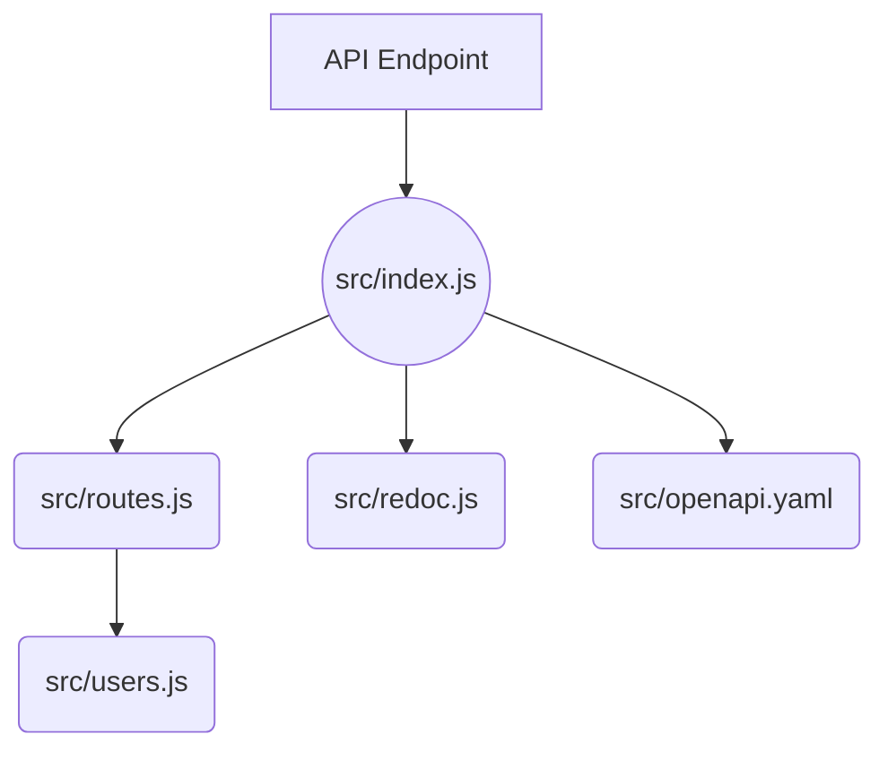

# GitHub DX Demo

Demo repository to show an integrated developer experience flow working with GitHub ecosystem components.

## WIP

- [ ] Create an Actions workflow to interact with submitted Issues and PRs
- [ ] Complete "Using this Repository" section with narrative instructions
- [ ] Complete updating README with useful information about this repository for reference
- [ ] Update devcontainer configuration for a streamlined configuration to use with this repository
- [ ] Populate with issue and PR template(s)
- [ ] Create Actions workflows so that this can be a template repository and easily re-used

---

## Users API

This is an Express API application that provides sample users with data via an API endpoint that can be used by other applications to populate test data.

## Application Layout

Here's a mermaid diagram of the application layout:



## App Content

The [./src](./src/) directory contains the following files:

- [index.js](./src/app.js): This file sets up the Express app and defines the routes for the API.
- [routes.js](./src/routes.js): This file defines the routes for the API. It uses the users.js file to handle requests to the /users endpoint.
- [users.js](./src/users.js): This file contains the controller functions for the /users endpoint. It reads the sample user data from the users.json file and returns it in response to requests.
- [openapi.yaml](./src/openapi.yaml): This file contains the OpenAPI specification for the UsersAPI. It is used to generate the API documentation.
- [redoc.js](./src/redoc.js): This file contains the configuration for the ReDoc API documentation.  Relies on the openapi.yaml file.

## Docker Packaging

This project is packaged using a Docker container for runtime distribution. :ship:

To build the Docker container locally, follow these steps:

- Build the Docker image using the following command:

  ```bash
  docker build -t <image-name> .
  ```

- Replace <image-name> with a name for your Docker image.
- Run the Docker container using the following command:

  ```bash
  docker run -p 3000:3000 <image-name>
  ```

  This will start the Docker container and make it available at [http://localhost:3000](http://localhost:3000).
